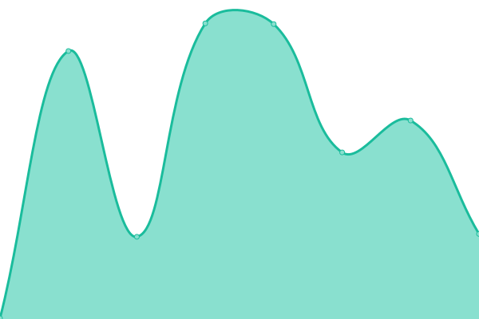
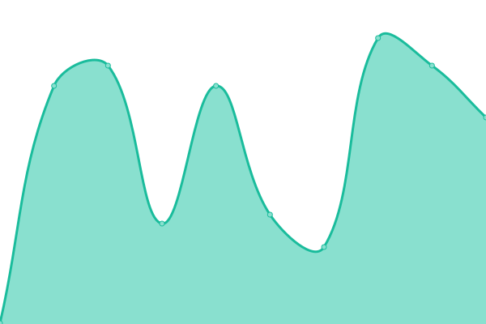

# [📈 Live Status](https://andrew.github.io/upptime): <!--live status--> **🟩 All systems operational**

This repository contains the open-source uptime monitor and status page for [Andrew Nesbitt](https://nesbitt.io), powered by [Upptime](https://github.com/upptime/upptime).

With [Upptime](https://upptime.js.org), you can get your own unlimited and free uptime monitor and status page, powered entirely by a GitHub repository. We use [Issues](https://github.com/andrew/upptime/issues) as incident reports, [Actions](https://github.com/andrew/upptime/actions) as uptime monitors, and [Pages](https://andrew.github.io/upptime) for the status page.

<!--start: status pages-->
<!-- This summary is generated by Upptime (https://github.com/upptime/upptime) -->
<!-- Do not edit this manually, your changes will be overwritten -->
<!-- prettier-ignore -->
| URL | Status | History | Response Time | Uptime |
| --- | ------ | ------- | ------------- | ------ |
|  [Google](https://www.google.com) | 🟩 Up | [google.yml](https://github.com/tt8899terry/upptime/commits/HEAD/history/google.yml) | 

 102ms
     
 | 

<a href="https://tt8899terry.github.io/upptime/history/google">100.00%</a>
    

|  [Wikipedia](https://en.wikipedia.org) | 🟩 Up | [wikipedia.yml](https://github.com/tt8899terry/upptime/commits/HEAD/history/wikipedia.yml) | 

 208ms
     
 | 

<a href="https://tt8899terry.github.io/upptime/history/wikipedia">99.82%</a>
    

|  [Hacker News](https://news.ycombinator.com) | 🟩 Up | [hacker-news.yml](https://github.com/tt8899terry/upptime/commits/HEAD/history/hacker-news.yml) | 

 248ms
     
 | 

<a href="https://tt8899terry.github.io/upptime/history/hacker-news">100.00%</a>
    

|  [just payd ping](https://www.justpayd.com) | 🟩 Up | [just-payd-ping.yml](https://github.com/tt8899terry/upptime/commits/HEAD/history/just-payd-ping.yml) | 

 277ms
     
 | 

<a href="https://tt8899terry.github.io/upptime/history/just-payd-ping">100.00%</a>
    

<!--end: status pages-->

[**Visit our status website →**](https://tt8899terry.github.io/upptime)

## 📄 License

- Powered by: [Upptime](https://github.com/upptime/upptime)
- Code: [MIT](./LICENSE) © [Andrew Nesbitt](https://nesbitt.io)
- Data in the `./history` directory: [Open Database License](https://opendatacommons.org/licenses/odbl/1-0/)
